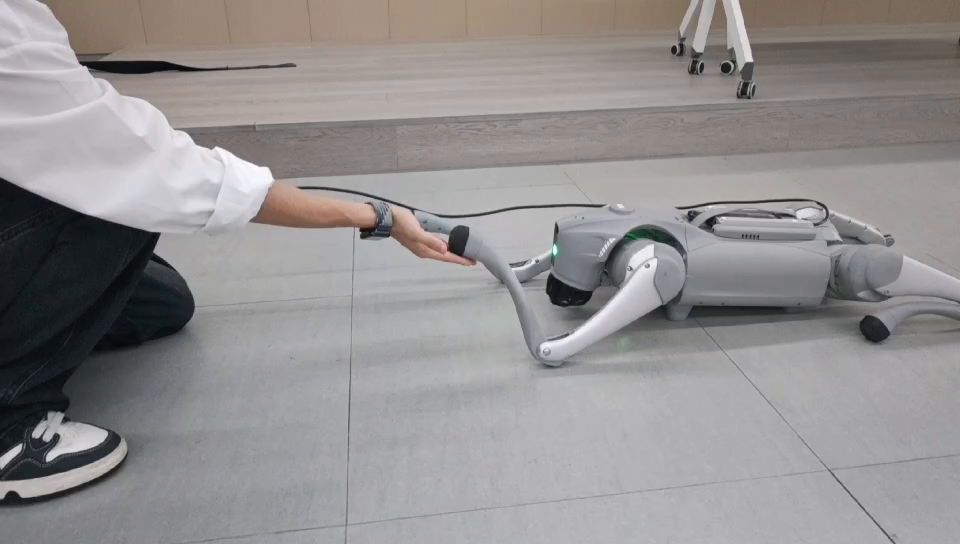
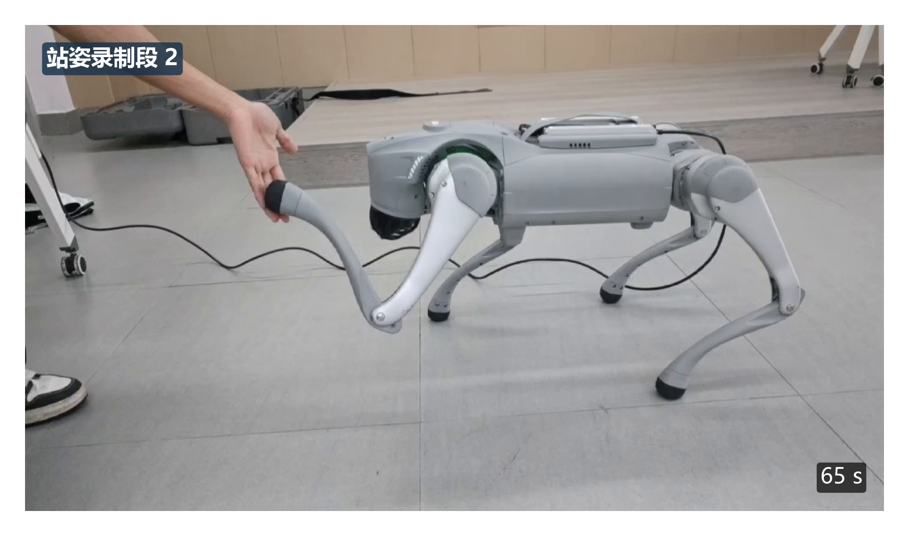

# GO2 Visual Paw Interaction

这是一个面向 Unitree GO2 EDU 的视觉引导前足人机交互研究原型。系统使用机器人自带前置单目 RGB 相机检测用户手部，在受约束的固定交互区域内判断手位于画面左侧或右侧，随后由趴姿控制器选择对应前足、执行接近、接触保持和安全退出。

本仓库是面向论文核验与学术交流的 **公开 GitHub 研究包**，不是成熟产品。仓库当前未附带开源许可证；公开可见不等于自动授予复制、修改或再分发许可。

## 论文与阅读入口

**Constrained Monocular Vision-Guided Handshake Interaction for Quadruped Robots**

Liangbin Wu†, Shouchen Chen†, Yihuang Zheng, Hongxin Chen and Xiaowei Chen*.

† 吴良斌、陈守晨共同第一作者；* 陈小薇为通讯作者。

论文已被 **CCICS 2026 接收，稿件编号 CC178**。这是录用状态，不代表已出版或已被 EI 检索。最终出版信息和 DOI 尚未确认；PDF 待公开权限核实后再添加，私人录用邮件与注册材料不上传。

- [论文信息与结果—材料索引](docs/PAPER.md)
- [快速开始：无需机器狗的离线检查](docs/QUICKSTART.md)
- [论文中的趴姿 MLP / GRU 对比](data/policy_comparison/README.md)
- [v0.2.0 更新说明](docs/RELEASE_NOTES_v0.2.0.md) · [引用信息](CITATION.cff)

## 实际效果

**趴姿主实验：**十次正式尝试视频中的代表帧，不代表所有试验均无中止。



**站姿定性扩展：**第二个站姿录制段；三段记录与趴姿统计分开。



两张图片均为已公开的真实录像抽帧，来源和处理见[照片溯源](figures/figure_photo_provenance.md)。原始视频不随仓库分发。

## 研究范围

- 硬件：Unitree GO2 EDU，自带前置单目 RGB 相机。
- 感知：MediaPipe 手部检测、画面侧别判断、目标滤波与丢失处理。
- 执行：趴姿前足交互为主线；站姿交互仅作为独立的定性扩展。
- 场景：单名操作者、室内木地板、预先限定的固定交互区域。
- 边界：二维像素位置不是通用的机器人三维坐标。本项目不主张在任意三维位置完成视觉伺服握手。

## 系统结构

```text
GO2 单目图像
  -> 手部检测与画面区域门控
  -> 侧别信号与时间滤波
  -> 行为状态机
  -> 前足轨迹 / 策略增量 / VMC 稳定约束
  -> 接触事件、保持阶段与安全退出
```

## 真机证据口径

FORMAL-02 包含 10 次连续、被命令执行的趴姿真机尝试：

- 独立视频观察接触：10/10。
- 独立视频观察保持不少于 0.6 s：10/10。
- 无执行中止地完成：9/10。
- 执行中止：1/10，FORMAL-02-002 在观察到接触后出现 `TRACKING_ERROR`。
- 安全退出组成完成：10/10。
- 选足正确性：未测量；侧视机位不能可靠映射画面左右与机器人左右。

原始 trial 002 JSON 因当时的记录器缺陷保留了错误的 `execution_status=ok`。仓库不改写该原始记录，而是通过同目录下的 `CORRECTION_RECORD.md` 和逐次运行日志确定派生执行状态。

FORMAL-03 单独记录站姿扩展：三个录制段均得到执行层 `STAND_HS_OK`，但没有与 FORMAL-02 等价的独立端点标注，因此不与趴姿结果合并，也不表述为经过独立确认的 3/3 握手成功率。

## 目录

```text
real_go2/                 真机入口、策略推理、接触检测和 trial 记录
vision/                   单目视觉与几何辅助模块
simulation/               MuJoCo 训练、评测和控制辅助模块
models/                   趴姿部署模型、趴姿对比权重与站姿扩展模型
data/policy_comparison/   论文 MLP/GRU 评测 summary、逐步/逐回合数据
data/formal02/            十次趴姿 JSON、日志、标注、纠错和图源数据
data/formal03_standing/   站姿扩展记录，和主实验严格分开
schemas/                  trial schema v4 与数据字典
figures/                  论文图、图源数据和照片溯源
tools/                    schema 与发布包审计工具
docs/                     实验范围、环境、来源和可用性说明
```

## 离线检查

首次使用先看[环境安装和分级复现说明](docs/QUICKSTART.md)。只重算论文对比数字需要 NumPy，不需要机器人、相机或 MuJoCo 场景。

以下命令不连接机器人，也不发布控制消息：

```powershell
python -m unittest discover -s tests -v
python -m unittest discover -s simulation/tests -v
python -m unittest discover -s vision/tests -v
python tools/release_audit.py
python simulation/src/reconstruct_metrics.py data/policy_comparison/mlp --tol 1e-9
python simulation/src/reconstruct_metrics.py data/policy_comparison/gru --tol 1e-9
```

真实机器人入口先做静态源码审查；不要假定 `--help` 或名为 dry-run 的参数必然无副作用。自动验收不会执行任何联网控制或运动命令。

## 仿真模型对比：不要与站姿 GRU 混淆

| 趴姿 checkpoint | 输入 / 输出 | 平均距离（m） | 200 步完整轨迹 |
|---|---|---:|---:|
| MLP | 27 / 6 | 0.1053 | 20/20 |
| GRU | 27 / 6 | 0.1187 | 20/20 |

两者使用同一评测 seed 42 和 0.03–0.15 s 延迟范围，各有一个训练 seed。MLP 从旧权重续训，GRU 从随机参数开始，因此这只是两个归档 checkpoint 的描述性比较，不能据此给架构排优劣。20 条评测轨迹不是 20 个独立训练 seed。

论文对比用的原始 `.pt` 权重在 [models/prone_comparison/](models/prone_comparison/MODEL_CARD.md)。[models/standing_extension/](models/standing_extension/MODEL_CARD.md) 的 GRU 是另一套 **29 输入 / 12 输出**模型，不能代替它。FORMAL-02 真机主实验部署的是 MLP。

## 安全警告

真机低层控制可能导致突然运动、跌倒、夹伤、过热或硬件损坏。任何真机复现都必须由具备相应经验的人员负责，并至少满足：遥控器和急停可用、周围净空、机器人温度和姿态门限有效、操作者能够随时终止，以及先完成无运动检查。仓库作者不把研究代码描述为经过产品级安全认证的控制软件。

## 复现边界

本仓库没有捆绑 Unitree SDK、CycloneDDS、Unitree MuJoCo 资产或 `hand_landmarker.task`。相机内参工件在 Ubuntu VM 中曾按 ID 和哈希核验，但未进入 Windows 最终归档，因此这里不会声称标定文件已经随仓库提供。详见 `docs/ENVIRONMENTS.md`、`docs/DATA_AVAILABILITY.md` 和 `THIRD_PARTY_NOTICES.md`。

## English summary

This public research package contains the paper-aligned code, deployment models, compact real-robot evidence and figure sources for a Unitree GO2 EDU monocular-RGB paw-interaction prototype. The main experiment comprises ten commanded prone trials: observer-rated contact and a hold of at least 0.6 s were reported in 10/10 trial segments, while clean execution completed in 9/10 attempts and one attempt aborted with a tracking error after observed contact. Correct paw selection was not measurable from the lateral recording view. The three standing recordings are a separate qualitative extension. The system is restricted to a predefined interaction zone and does not claim general monocular 3D localization. No open-source licence is granted by repository visibility alone.
